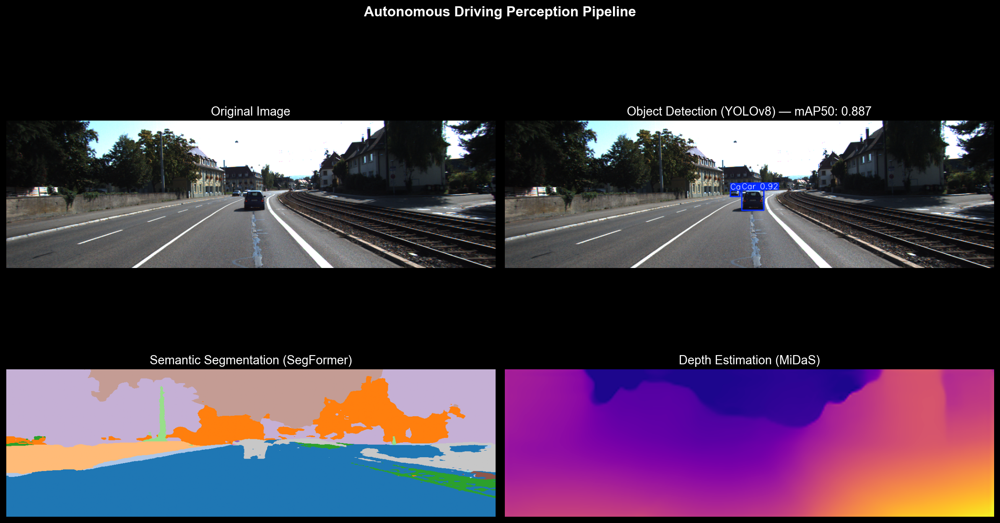

# 🚗 Autonomous Driving Perception Pipeline

An end-to-end, real-time Computer Vision and Deep Learning perception system for autonomous driving — evolved from a baseline detection pipeline into a fully modular, deployment-ready system with Forward Collision Warning (FCW).

---

## 📸 Pipeline Demo



---

## 📌 Project Evolution

### 🔴 Version 1 — Baseline Pipeline
The first version established the core perception foundation:
- ✅ **Object Detection** with YOLOv8n trained on KITTI — mAP50: **0.887**, mAP50-95: **0.641**
- ✅ **Semantic Segmentation** with SegFormer for full scene understanding
- ✅ **Monocular Depth Estimation** with MiDaS
- ✅ **Multi-Object Tracking** with ByteTrack
- ✅ **REST API** with FastAPI (`/detect`, `/segment`, `/pipeline` endpoints)

### 🟢 Version 2 — Improved & Optimized
Building on the baseline, this version introduces production-level improvements:
- ✅ **Enhanced FCW Logic** — dynamic safety alerts (`SAFE`, `WARNING`, `DANGER`) based on bounding-box spatial analysis
- ✅ **ONNX Export & Benchmarking** — optimized for edge deployment (NVIDIA Jetson, Automotive ECUs)
- ✅ **Modular Architecture** — clean separation into `perception/`, `api/`, and `scripts/`
- ✅ **Unit Tests** for FCW logic and distance estimation rules
- ✅ **Lightweight Repo** — excluded heavy runtime caches and raw datasets

---

## 📊 Results

| Model | mAP50 | mAP50-95 | Dataset |
|-------|-------|----------|---------|
| YOLOv8n | 0.887 | 0.641 | KITTI |

---

## 🧠 System Components

| Component | Model | Task |
|-----------|-------|------|
| Object Detection | YOLOv8n | Detect cars, pedestrians, cyclists |
| Semantic Segmentation | SegFormer | Full scene understanding |
| Depth Estimation | MiDaS | Monocular depth from single camera |
| Multi-Object Tracking | ByteTrack | Track objects across frames |
| Forward Collision Warning | Custom FCW | Real-time SAFE / WARNING / DANGER alerts |
| REST API | FastAPI | API access to all components |
| ONNX Benchmark | ONNX Runtime | Latency, FPS, memory benchmarking |

---

## 🏗️ Project Architecture

```
Perception-Autonomous-Driving/
├── api/                    # API endpoints and model serving
├── perception/             # Core CV and FCW modules
├── scripts/                # Utility and execution scripts
│   ├── convert_to_tensorrt.py
│   └── export_tensorrt.py
├── KITTI.ipynb             # Training and analysis notebook
├── API.py                  # FastAPI REST interface
├── onnx_benchmark.py       # Performance benchmarking
├── run_video_fcw.py        # Video inference with FCW alerts
├── test_fcw.py             # Unit tests for FCW logic
├── pipeline_demo.png       # Pipeline visualization
├── demo_video.mp4          # Full pipeline demo on KITTI
└── requirements.txt        # Dependencies
```

---

## 🚀 Getting Started

### 1. Clone the Repository
```bash
git clone https://github.com/mobinazarezadeh/-Perception-Autonomous-Driving-.git
cd -Perception-Autonomous-Driving-
```

### 2. Install Dependencies
```bash
pip install -r requirements.txt
```

### 3. Run the REST API
```bash
uvicorn API:app --reload
```
Then open `http://localhost:8000/docs` to test all endpoints interactively.

### 4. Run FCW Demo on Video
```bash
python run_video_fcw.py
```

### 5. Benchmark Model Performance
```bash
python onnx_benchmark.py
```

### 6. Run Unit Tests
```bash
python test_fcw.py
```

---

## 🔌 API Endpoints

| Endpoint | Method | Description |
|----------|--------|-------------|
| `/detect` | POST | Object detection on uploaded image |
| `/segment` | POST | Semantic segmentation |
| `/pipeline` | POST | Full pipeline — detection + segmentation |

---

## 📁 Dataset

**KITTI Object Detection Dataset:**
- 7,481 training images from real driving scenarios
- 5 classes: Car, Pedestrian, Cyclist, Van, Truck
- 80/20 train/val split

---

## 🛠️ Tech Stack

- **PyTorch** — Deep learning framework
- **Ultralytics YOLOv8** — Object detection
- **HuggingFace Transformers** — SegFormer segmentation
- **MiDaS** — Monocular depth estimation
- **ByteTrack** — Multi-object tracking
- **FastAPI** — REST API
- **ONNX Runtime** — Edge deployment and benchmarking
- **OpenCV** — Image and video processing

---

## 📹 Demo Video

`demo_video.mp4` — Full pipeline visualization running on 50 consecutive KITTI frames, showing detection, segmentation, and depth estimation simultaneously.

---

## 📜 License

Distributed under the MIT License.
